[🇬🇧 English version](README.md)

# Инструкции по прошивке и настройке RNode

Это руководство объясняет, как прошить прошивку RNode и настроить устройство RNode в качестве интерфейса Reticulum с помощью приложения **Columba** на Android.

## Требования

- Смартфон Android с поддержкой USB OTG
- Кабель USB OTG (On-The-Go)
- Совместимое устройство RNode (например, Heltec LoRa 32 v3, плата ESP32 с LoRa)
- Установленное на Android-устройство приложение [Columba](https://github.com/attermann/columba)

---

## Часть 1 — Прошивка устройства

### Шаг 1 — Подключите устройство и откройте Flash Firmware

Подключите устройство RNode к смартфону Android с помощью кабеля USB OTG. Приложение Columba обнаружит USB-устройство и отобразит меню действий. Нажмите **Flash Firmware**, чтобы обновить или установить прошивку RNode на устройство.

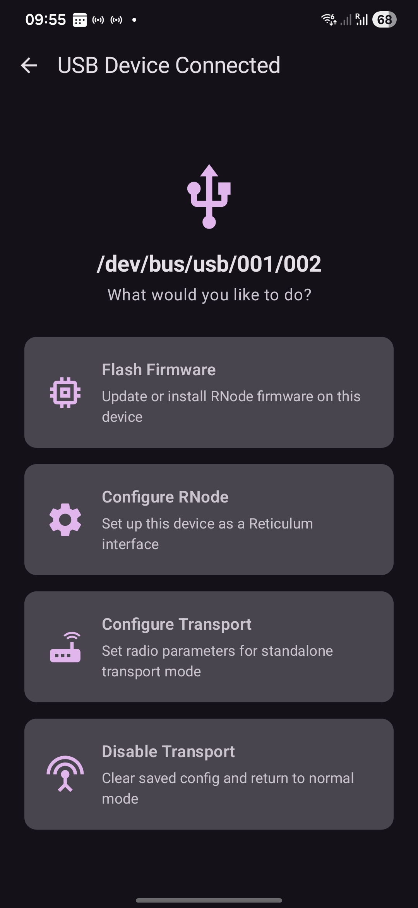

---

### Шаг 2 — Разрешите доступ к USB

Откроется мастер RNode Flasher. Появится системный диалог с запросом на доступ приложения Columba к подключённому USB-устройству. Нажмите **OK**, чтобы разрешить доступ.

---

### Шаг 3 — Выберите USB-устройство

После предоставления разрешения ваше устройство появится в списке как **Unknown Device** с VID и PID (например, VID: 0x303A | PID: 0x0002). Выберите его (появится галочка) и нажмите **Continue**.

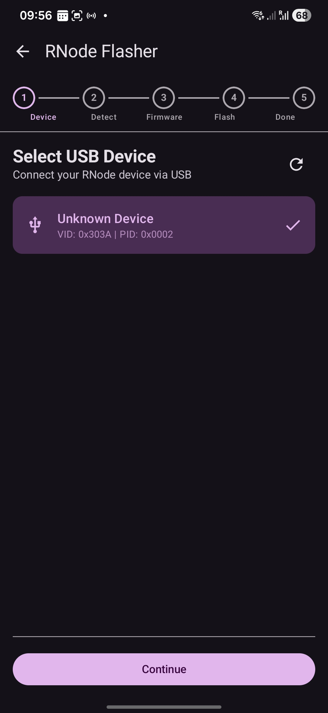

---

### Шаг 4 — Определение устройства (ручной выбор)

Приложение попытается автоматически определить тип платы. Если автоопределение завершится неудачей, появится сообщение **Detection Failed**. Это нормально для общих плат ESP32. Нажмите **Continue with Manual Selection**, чтобы продолжить и выбрать тип платы вручную на следующем шаге.

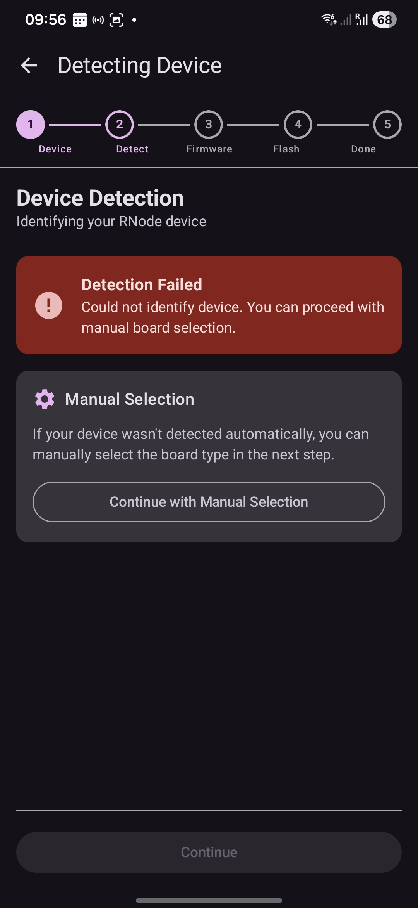

---

### Шаг 5 — Выберите тип платы и начните прошивку

Выберите тип платы из списка (например, *Heltec LoRa 32 v3*). Приложение загрузит и прошьёт соответствующую прошивку. На экране появится индикатор прогресса с текущим процентом прошивки и статусом (например, *Syncing with bootloader…*).

> ⚠️ **Не отключайте устройство во время прошивки.**

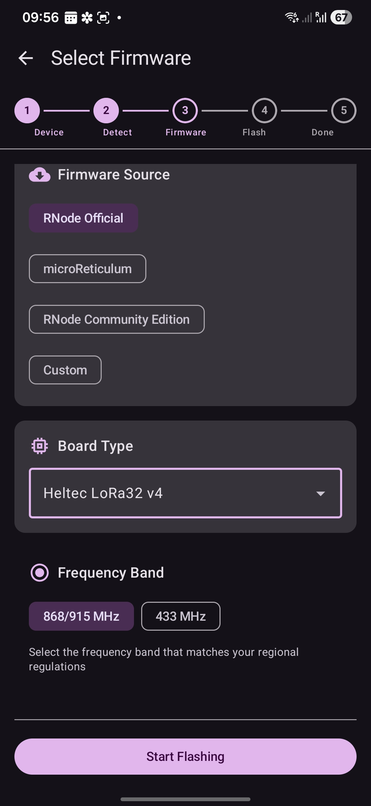

---

### Шаг 6 — Дождитесь завершения прошивки

Процесс прошивки продолжается до 100%. Статусные сообщения обновляются по мере завершения каждого этапа (синхронизация, стирание, запись, верификация).

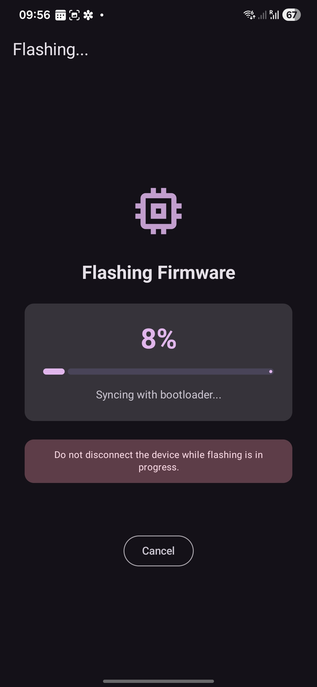

---

### Шаг 7 — Прошивка завершена

После завершения прошивки мастер перейдёт на экран **Done**, подтверждающий успешное выполнение. Устройство автоматически перезагрузится с новой прошивкой.

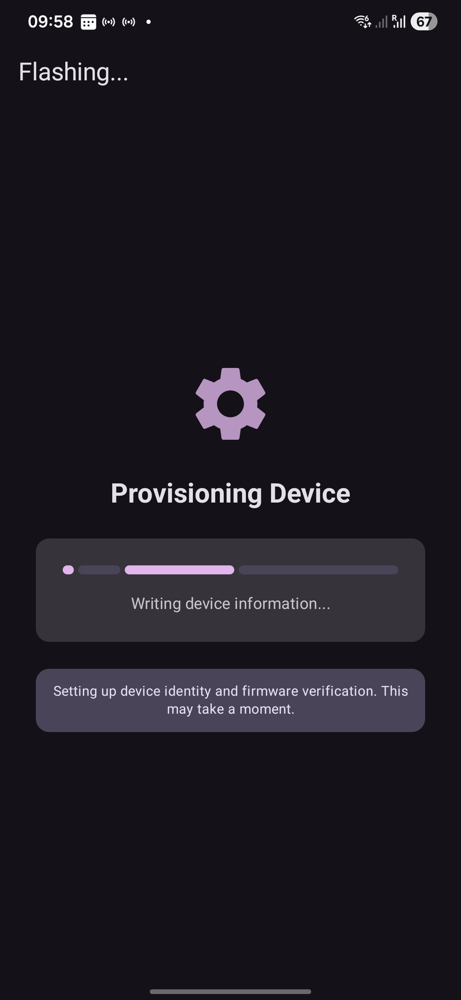

---

### Шаг 8 — Проверьте устройство

После прошивки светодиод устройства должен загореться, что свидетельствует о правильной работе прошивки.

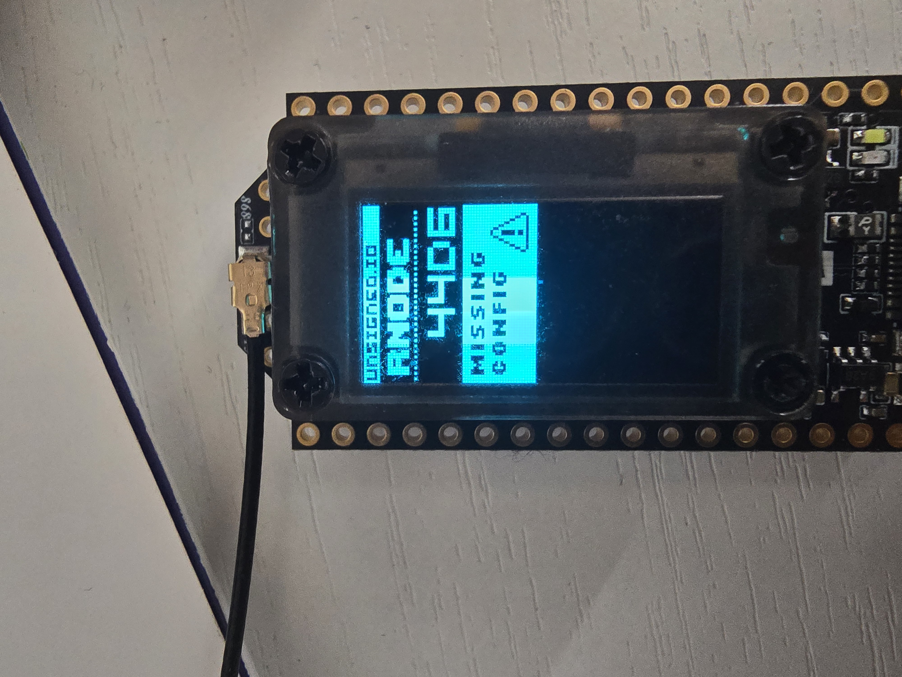

---

## Часть 2 — Настройка RNode

### Шаг 1 — Откройте Configure RNode

Подключите устройство снова или оставьте его подключённым. Снова появится меню «USB Device Connected». Нажмите **Configure RNode**, чтобы настроить устройство в качестве интерфейса Reticulum.

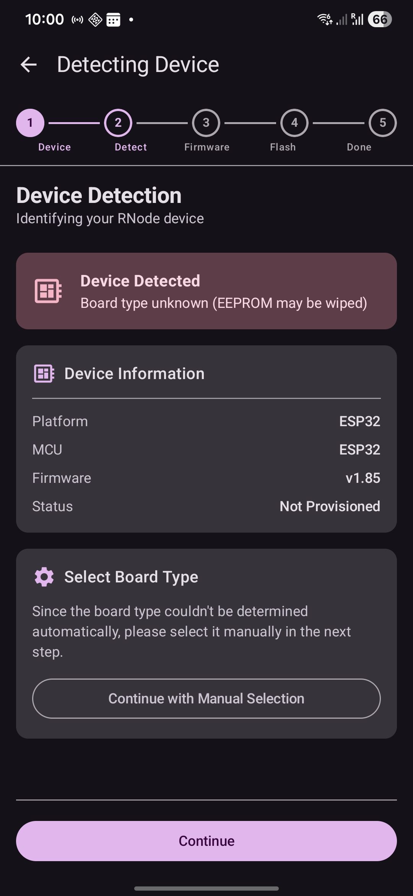

---

### Шаг 2 — Введите параметры радио

Откроется экран настройки. Установите следующие параметры радио в соответствии с региональным частотным планом и требованиями сети:

- **Frequency** — несущая частота в МГц (например, `868.0` для Европы, `915.0` для Северной Америки)
- **Bandwidth** — ширина полосы канала (например, `250 кГц`)
- **TX Power** — мощность передатчика в дБм (например, `17`)
- **Spreading Factor** — коэффициент расширения LoRa (например, `8`)
- **Coding Rate** — скорость кодирования LoRa (например, `5`)

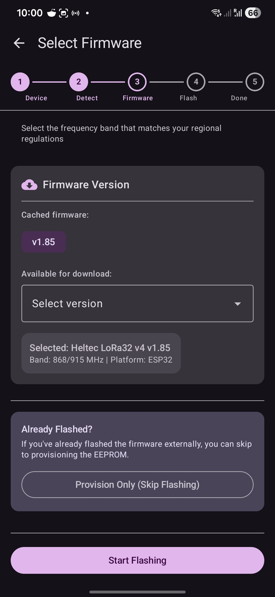

---

### Шаг 3 — Физическое устройство во время настройки

Устройство остаётся подключённым через USB на протяжении всего процесса настройки.

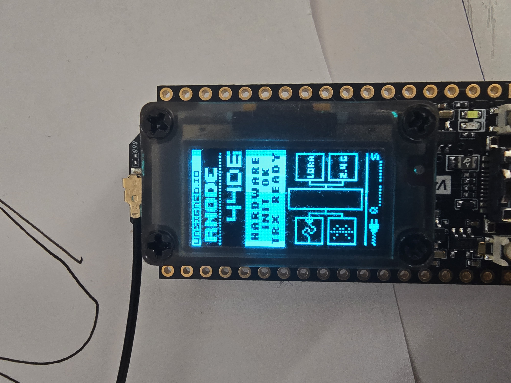

---

### Шаг 4 — Применение конфигурации

Проверьте настройки и нажмите **Apply** или **Save**, чтобы записать конфигурацию на устройство.

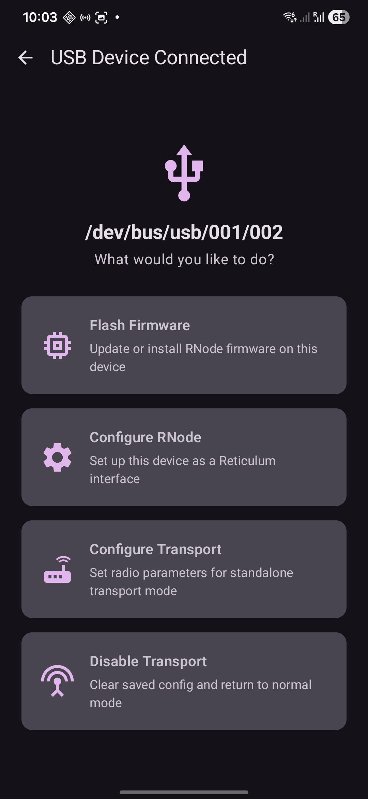

---

### Шаг 5 — Подтверждение настроек

Приложение может отобразить подтверждение или сводку записанной конфигурации.

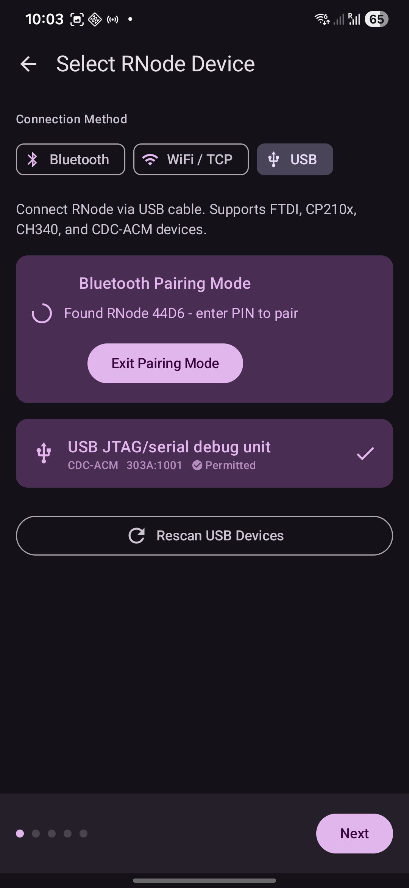

---

### Шаг 6 — Настройка завершена

RNode будет настроен и готов работать в качестве интерфейса Reticulum. Сообщение об успешном выполнении подтвердит сохранение конфигурации на устройстве.

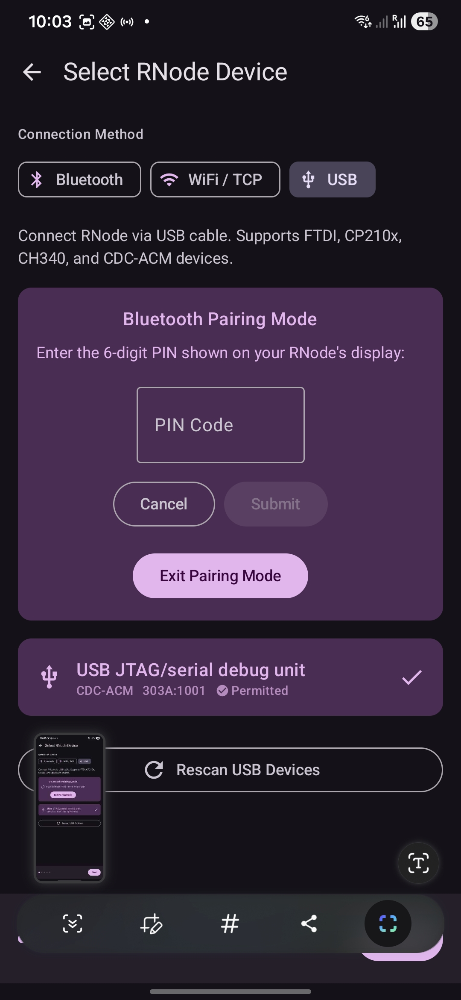

---

### Шаг 7 — Интерфейс Reticulum готов

Устройство теперь настроено и будет отображаться как LoRa-интерфейс в Reticulum. Вы можете проверить его активность в списке интерфейсов приложения Columba.

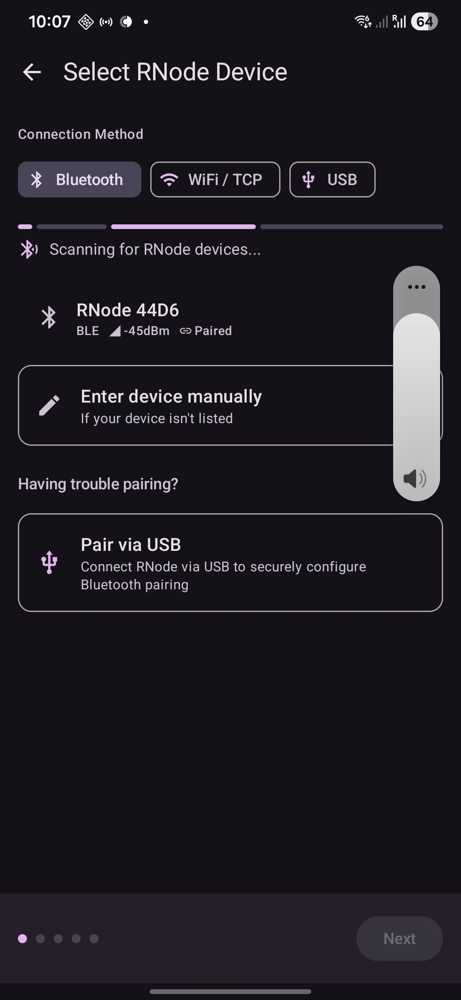

---

## Дополнительные возможности

Меню «USB Device Connected» также предлагает:

| Параметр | Описание |
|---|---|
| **Configure Transport** | Установить параметры радио для автономного режима транспортного узла (маршрутизатора) |
| **Disable Transport** | Очистить сохранённую конфигурацию транспорта и вернуть устройство в обычный режим интерфейса |
